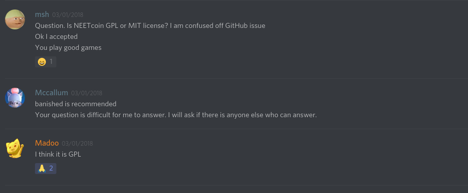
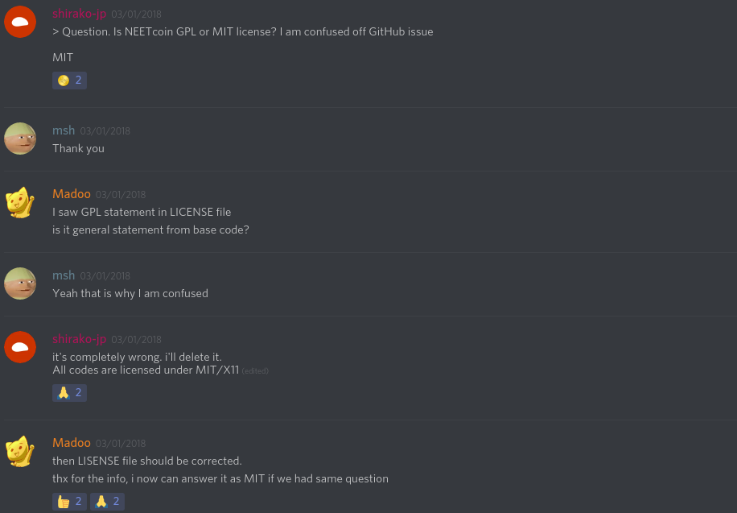

## Team assessment and planning
The biggest strength we have as a team is having 3 of our members familiar with python (which allow us to write tests) as well as the multiple different development environments we have (which will help with out contribution to issues on github). However, our biggest weakness is the unfamiliarity with C++, and having such a large code base to work off of. Just a few quick skims of the code shows barely any sign of documentation.

## Milestones
1. Become familiar with the code base - Bitcoin is quite a large project, so become familiar with the code base would be quite the milestone. Being familiar with the base helps us understand what is going on under the hood, and would allow us to be able to contribute better to discussions as well as write python tests. Some resources we can use if we have any questions would be the various different bitcoin communication channels such as slack or IRC.

2. Writing python tests - After being familiar with the code base, we should test our knowledge by writing tests and utilize all other developer tools we are given to help aid the development of bitcoin.

3. Contribute to github discussions - Being able to contribute to bitcoin discussions on github. This is where our different development environments come into play as we can help identify issues with out different environments

4. Solve an issue and offer a pull request - solving an issue on github shows our knowledge and is one of the biggest ways to contribute to a open source project

## Other Cool Stuff That Happened
I've been getting to know these Japanese developers that have been working on a alt-coin called NEET coin which attempts to create a crypto-currency (most of their code is based off of bitcoin) to implement a universal basic income system. After looking over their code base i brought to their attention on their Discord server (the chat application i've been using to communicate with them) that their license on github, and some of the licenses within the code base weren't matching up. A github issue was [open](https://github.com/NEETCOINTeam/NEETCOIN/issues/5) I asked them what license they were actually using, and while one of the developers answered "GPL" the main dev decided to just change it to MIT. 
Here are some screenshots of the conversation.

[link to the discord](https://discord.gg/wWG4AzV)

## Events
I went to the Bugs Open NYC Event aswell as the Creative Center in Brooklyn for an Open Data display on saturday.

